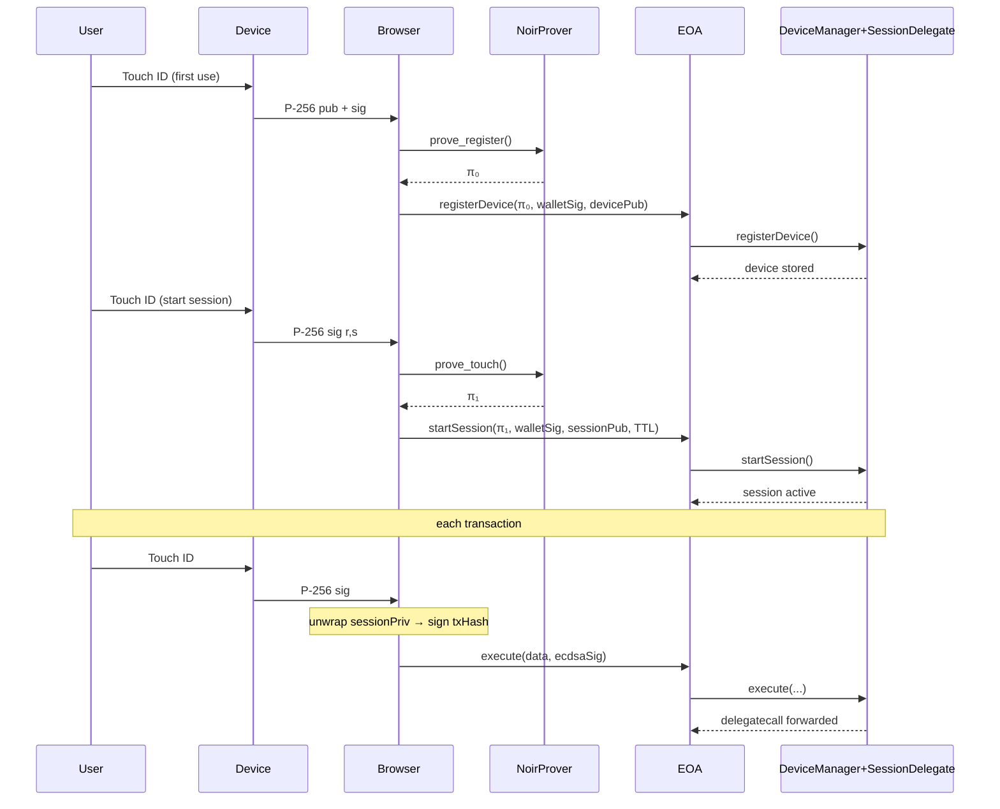

# AuthDevice7702

Hardware-locked session keys for EIP-7702 smart-EOAs.
One touch → short-lived key → ultra-cheap tx.

## 🔑 How It Works (The Hybrid Model)

The flow is designed to be both secure and gas-efficient, combining a one-time ZK proof for setup with cheap `ecrecover` for each transaction.

1.  **Device Registration (One-time)**: The user's hardware device (e.g., via Touch ID/Face ID) is registered on-chain. A ZK proof verifies the device's signature, linking its public key to the user's EOA in a `DeviceManager` contract.

2.  **Session Authorization**: To start a session, the user signs a message with their main wallet, authorizing a new, temporary session key. A second ZK proof, generated from a hardware touch, confirms the user's presence. The `DeviceManager` then activates the session with a set time-to-live (TTL).

3.  **Transaction Execution**: For every transaction within the session:
    - The user performs a hardware touch (e.g., Touch ID).
    - This action locally decrypts the session's private key (which is stored AES-encrypted in the browser).
    - The decrypted key signs the transaction, and the raw key is immediately cleared from memory.

4.  **On-Chain Verification**: The smart EOA's `SessionDelegate` validates the transaction using `ecrecover`. This is extremely gas-efficient (≈3,000 gas), as it avoids costly on-chain ZK proof verification for every action.

No session key bytes ever leave the browser, yet you avoid per-tx ZK gas.

## Sequence Diagram

