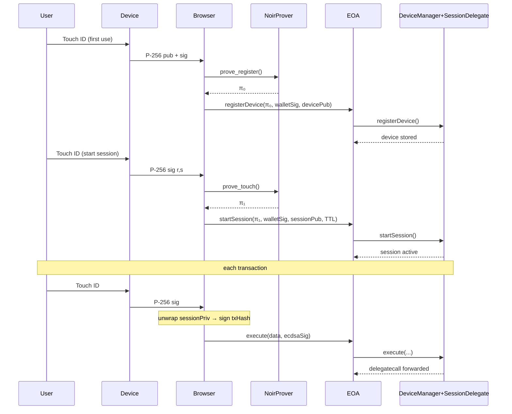

# AuthDevice7702

Hardware-locked session keys for EIP-7702 smart-EOAs.
One touch → short-lived key → ultra-cheap tx.

## 🔑 Concept
Register device – WebAuthn pubkey + ZK proof → on-chain DeviceManager.

Start session – wallet signs the new sessionPubKey; ZK proof (device touch) stores it with TTL.

Every tx – user touches again; browser unwraps the AES-encrypted sessionPriv (never stored raw) and signs.

On-chain – SessionDelegate just runs ecrecover (≈ 3 k gas) and amount/permission checks.

No session key bytes ever leave the browser, yet you avoid per-tx ZK gas.

## Sequence Diagram

