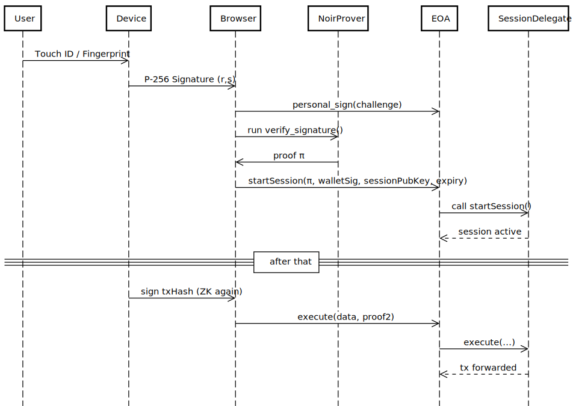

# AuthDevice7702

This project is a Proof of Concept (PoC) for a system that authorizes session-based transactions using on-device authentication such as Touch ID or Fingerprint. It utilizes ZK (Zero-Knowledge) proofs to verify WebAuthn signatures on-chain and securely delegate session keys.

## Sequence Diagram

The diagram below illustrates the entire flow, from user authentication to transaction execution.



### Diagram Source (Mermaid)

```mermaid
sequenceDiagram
  participant User
  participant Device
  participant Browser
  participant NoirProver
  participant EOA
  participant SessionDelegate

  User->>Device: Touch ID / Fingerprint
  Device->>Browser: P-256 Signature (r,s)
  Browser->>EOA: personal_sign(challenge)
  Browser->>NoirProver: run verify_signature()
  NoirProver->>Browser: proof π
  Browser->>EOA: startSession(π, walletSig, sessionPubKey, expiry)
  EOA->>SessionDelegate: call startSession()
  SessionDelegate-->>EOA: session active
  == after that ==
  Device->>Browser: sign txHash (ZK again)
  Browser->>EOA: execute(data, proof2)
  EOA->>SessionDelegate: execute(...)
  SessionDelegate-->>EOA: tx forwarded
```
