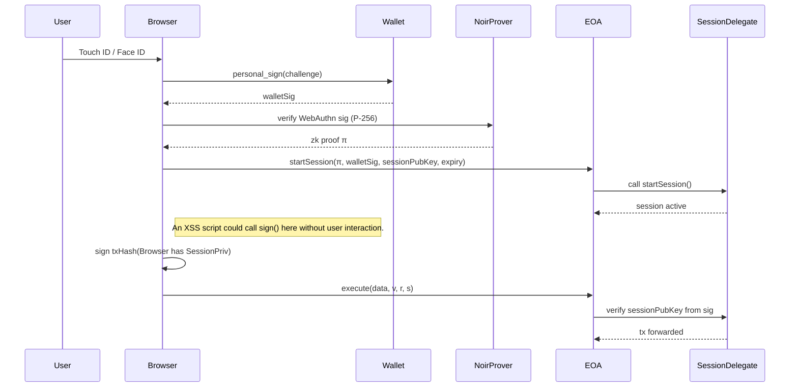
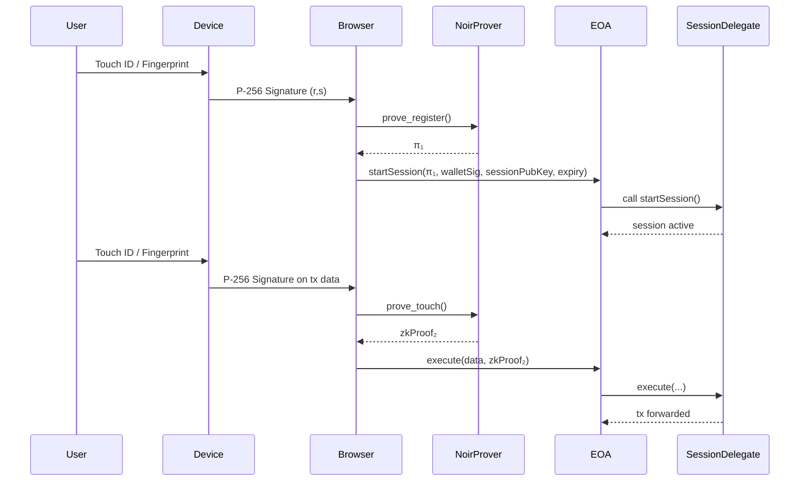
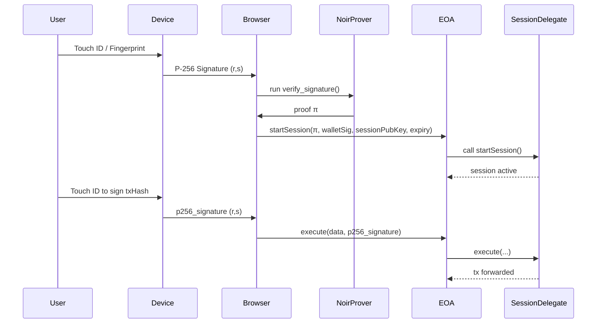
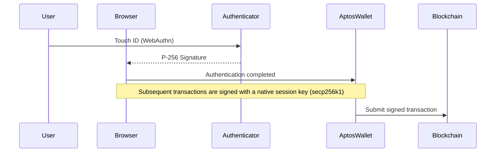
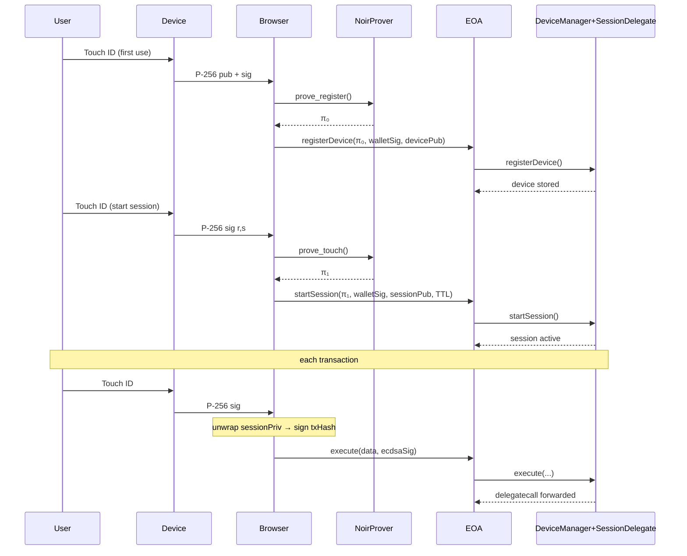

# Research Draft v0.1 – GPT-o3 Summary (Verification Needed)

## EIP-7702 + WebAuthn


## Session Private Key (sessionPriv) vs. MetaMask Seed Phrase (Mnemonic)

| Comparison Item | `sessionPriv` (Browser Session Key) | MetaMask Seed Phrase |
| --------------- | ------------------------------------------------------------------------------------------------------------------------ | ------------------------------------------------------------------------------------------------------------------------- |
| **Where stored?** | In page's JS context (RAM). Can be persisted in IndexedDB/localStorage, potentially AES-GCM wrapped, but unlockable by JS code. | In an **encrypted vault** (IndexedDB/Extension folder) ¹. |
| **Exportable?** | With WebCrypto `extractable:false`, raw bytes aren't exposed, but ***JS code can call `crypto.subtle.sign()` to sign anything***. ² | Seed bytes aren't directly readable by JS. <br>Theft requires extracting the **vault file + user password** ¹,³. |
| **XSS Script Impact** | Injected JS can use `sessionPriv` to sign arbitrary transactions → **Direct financial loss**. | JS can't access the MetaMask background process. <br>Sending a transaction requires user approval via a MetaMask UI popup → **User interaction required**. |
| **Local Disk Attack** | Generally none if only in RAM (lost on power-off). If persisted, vulnerable to file system attacks. | An attacker needs physical PC access to copy files and the user's password to decrypt the vault. |
| **Session/Lock State**| Key is active until the session expires → **Active for minutes or hours**. | Key is unloaded when MetaMask is locked. |
| **Theft Difficulty**| **Low**: XSS or malicious extensions can lead to immediate unauthorized signing. | **High**: Requires vault extraction, the user's password, and decryption ¹,³. |
| **Damage Scope**    | Limited to the permissions and TTL granted to the session key. | **The entire wallet and all its assets** are compromised. |

**Footnotes & References**
¹ While robust, this is not foolproof. A browser zero-day exploit could allow a malicious background script to persist and bypass UI interactions.
² See StackOverflow discussion on `extractable:false`: [stackoverflow.com](https://stackoverflow.com/questions/53159882/when-does-webcrypto-exportable-false-protect-a-secret-key-from-adaptive-chosen-p?utm_source=chatgpt.com)
³ Sources on MetaMask vault and recovery: [MetaMask Help Center](https://support.metamask.io/configure/wallet/how-to-recover-your-secret-recovery-phrase/?utm_source=chatgpt.com), [Deep Dive](https://rya-sge.github.io/access-denied/2023/07/20/metamask-secret/?utm_source=chatgpt.com), [Stack Exchange](https://ethereum.stackexchange.com/questions/52658/where-does-metamask-store-the-wallet-seed-file-path?utm_source=chatgpt.com).

### Summary
- A `sessionPriv` is a live key used directly by the browser page, making it vulnerable to asset theft via a simple signing API call from an XSS or malicious script.
- A MetaMask seed is protected within an encrypted vault, inaccessible to the JS context. Theft requires multiple steps: file extraction and obtaining the user's password.
- Therefore, `sessionPriv` has a higher probability of theft (lower attack difficulty), while a compromised seed phrase results in far greater potential damage.

---

## Option 1: Using a Sandboxed Session Key (e.g., in a Wallet Extension)

> EIP-5792 (“wallet_sendCalls”) and the preceding EIP-5630 propose a multi-call API that could standardize session key functionality within wallets.

This approach suggests that the `sessionPriv` should be managed inside a sandbox, like a browser extension's vault, similar to how MetaMask handles the master seed.

**Implementation Notes:**
- **Examples**: Some wallets are already experimenting with this. For instance, OKX Wallet has a beta "Session Sign" feature.
- **Governance is Key**: This model's security heavily relies on robust session governance UIs, allowing users to easily monitor active sessions, set granular permissions, and instantly revoke them.

---

## Option 2: Per-Transaction ZK Proof from WebAuthn (Passkey)

This model enhances security by requiring a hardware-backed signature for every transaction, verified on-chain with a ZK proof.



| Perspective | MetaMask (Extension Wallet) | Passkey Hardware Authentication |
| ------------- | ----------------------------------------------------- | ----------------------------------------------------- |
| **Private Key Storage Location** | Encrypted Vault (extension process) | Secure Enclave·TPM·YubiKey internal |
| **Signature Approval Process**  | Click "Approve" in UI popup | OS-level biometric/PIN + device signature |
| **Key Loading Period**   | Persistently active after wallet unlock | One-time signature per transaction |
| **Phishing/False Signature**  | Users can be deceived on fraudulent sites | Browser is a carrier; signature cannot be forged |
| **Seed Phrase Risk** | Seed exposure = complete asset theft | Keys stored on device without seed phrases |
| **Application by Scale**    | Optimal for low-value, high-frequency use | Ideal for high-value assets, institutional use, and compliance |

**Pros**: High security with hardware-backed verification for every transaction.
**Cons**: Costly, as it requires an on-chain ZK proof verification for every `execute()` call.¹

**Footnotes**
¹ On-chain Plonk verification gas costs can range from 230k to 280k, making this expensive for frequent transactions.

---

## Option 3: Using Passkey Directly as a Session Key? (Low Feasibility)

This explores using the P-256 key from WebAuthn directly as the session key for signing transactions.


❌ **Primary Blocker**: WebAuthn uses the P-256 curve, which is incompatible with the EVM's `ecrecover` (which expects secp256k1). An on-chain contract cannot natively verify the signature.

**Note on other ecosystems**: While incompatible with the EVM, some blockchains like Stacks have found ways to support P-256 (ES256) signatures, making this approach viable in those specific contexts.

---

## How Does Aptos Solve This?
Aptos uses a two-step process that separates authentication from transaction signing.



1.  **Authentication**: Users are authenticated with a WebAuthn passkey (P-256).
2.  **Signing**: Actual blockchain transactions are signed with a separate, chain-native key (e.g., secp256k1 or Ed25519)¹.

> The flow is: **Passkey Authentication → Session Key Creation → Transaction Signing with Session Key**.

This model uses WebAuthn as the **primary authentication** method to authorize a **secondary, transaction-signing key**, avoiding the need for per-transaction hardware interaction for signing.

**Footnotes**
¹ Aptos is flexible; its SDK's `EntryFunctionPayload` also accommodates Ed25519 signatures.

---

## Option 4: The AuthDevice7702 Model (Hybrid Approach)

This model combines a ZK-verified WebAuthn signature to start a session with a per-transaction hardware touch to unlock a temporary, AES-encrypted session key.

| Aspect | Description |
| :--- | :--- |
| **Pros** | - **High Security**: Requires hardware touch for every transaction. <br> - **Low Gas**: Avoids on-chain ZK proof for each transaction, using cheap `ecrecover` instead. <br> - **No Raw Key Exposure**: Session private key is never stored unencrypted. |
| **Cons** | - **Complexity**: More moving parts (ZK prover, AES encryption). <br> - **Potential Attack Vector**: Requires careful implementation to prevent touch-loop attacks during key unwrapping. |


**Key Security Considerations:**
-   **Touch-Loop Attack**: A malicious script could try to repeatedly trigger the `Touch ID` prompt to unwrap the session key for multiple unauthorized transactions. The implementation must ensure that one touch corresponds to exactly one signature for a specific, user-approved transaction.
-   **Session Key Zeroization**: After signing, the unwrapped `sessionPriv` must be immediately cleared from memory (zeroized) to minimize its exposure time.

**Example Contract Snippet (Session Management):**
```solidity
// Simplified example of what DeviceManager+SessionDelegate might store
struct Session {
    bytes32 sessionPubKeyHash; // Hashed public key for the session
    uint64 expiry;            // Session TTL
    uint256 maxSpend;         // Max value per transaction
}

mapping(address => Session) public activeSessions;

function startSession(bytes32 sessionPubKeyHash, uint64 expiry, uint256 maxSpend) external {
    // Authenticated by the EOA's EIP-7702 authorization
    activeSessions[msg.sender] = Session(sessionPubKeyHash, expiry, maxSpend);
}
```
WebAuthn proof starts the session. Subsequent transaction signing is authorized by a Passkey touch, which unlocks an AES-encrypted session private key.
